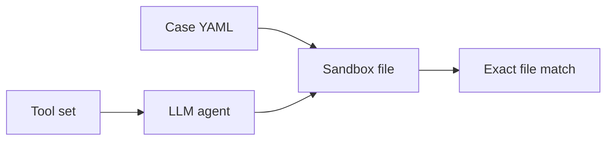
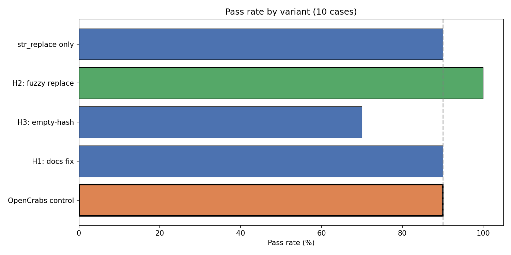
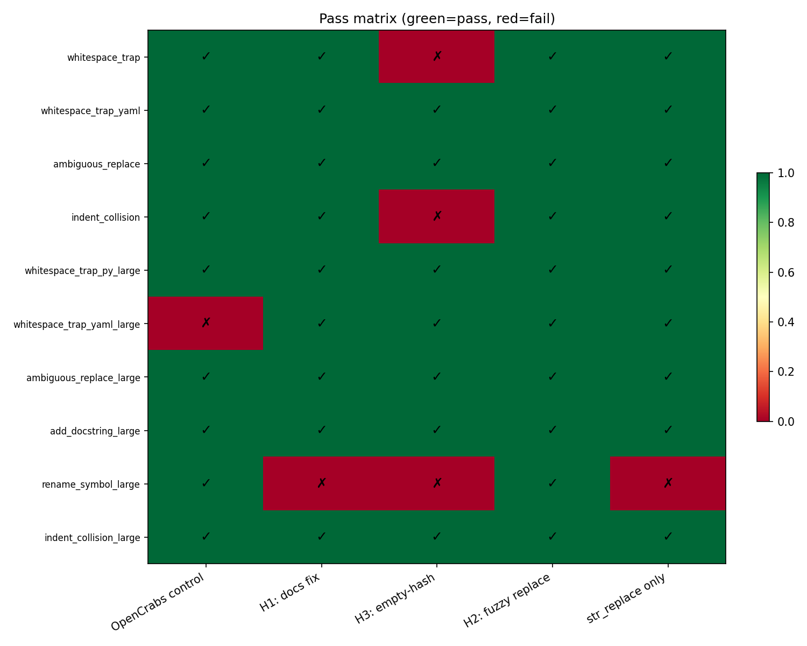
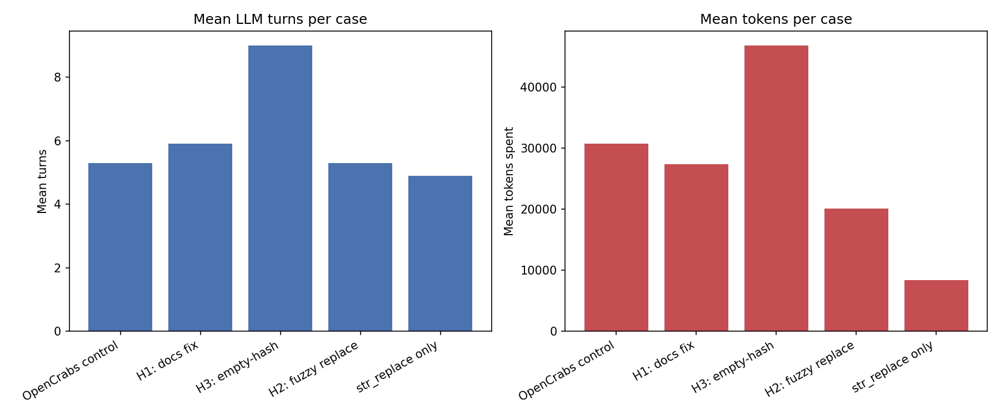
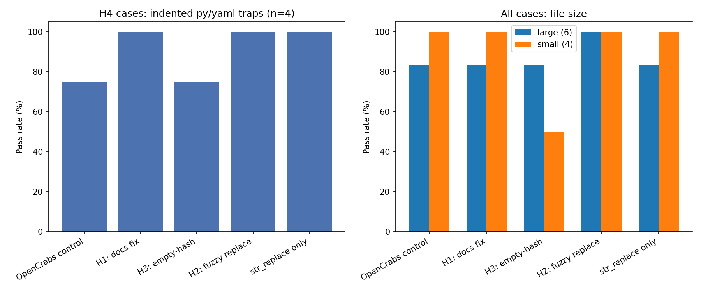

# Hashline edit evaluation — hypothesis results

External evaluation of OpenCrabs-style hashline tooling via a Python port in `harness_test`. **OpenCrabs upstream was not consulted** before this study was designed or run.

**Artifacts:** this document, [charts](hashline_hypothesis_report.ipynb), [matrix JSON](../reports/2026-05-23T13-22-35.666225+00-00_local-r_matrix.json) (50 runs, `minimax-m2.7`).

**Implementers:** start at [§2 Quick reference](#2-quick-reference-for-implementers). Full methodology is [§5](#5-methodology) onward.

---

## 1. Introduction

Researchers integrated OpenCrabs tools into `harness_test` to test four beliefs about `hashline_edit` / `read_file` observed while porting Rust tooling to Python. This is a **post-hoc report**, not a merged OpenCrabs PR or a Rust audit.

| Is | Is not |
|----|--------|
| Reproducible eval with methodology | Product sign-off |
| Evidence from a Python port | Multi-model benchmark |
| Input for docs/protocol decisions | Proof of byte-identical Rust behavior |

---

## 2. Quick reference for implementers

| If you are… | Verdict | Code in this repo |
|-------------|---------|-------------------|
| **Fuzzy line replace (H2)** | **Supported** — 10/10 pass; see [§8](#8-interpretation) | [`fuzzy_replace.py`](../src/harness/fuzzy_replace.py), [`str_replace_fuzzy`](../experiments/tooling/harness/str_replace_fuzzy.py), [`opencrabs_h2_fuzzy.yaml`](../experiments/tool_sets/opencrabs_h2_fuzzy.yaml) |
| **Hashline docs (H1)** | Inconclusive — still align docs | [`read_file`](../experiments/tooling/opencrabs/read_file.py), [`hashline_edit`](../experiments/tooling/opencrabs/hashline_edit.py), [`hashline.py`](../experiments/tooling/opencrabs/hashline.py) |
| **Collision display (H3)** | **Rejected** — do not ship `  \|` default | [`format_read_hashline`](../experiments/tooling/opencrabs/hashline.py), [H3 `read_file`](../experiments/tooling/opencrabs_h3/read_file.py) |
| **vs non-hashline edit (H4)** | Mixed — not uniformly worse | Reference tool set [`baseline.yaml`](../experiments/tool_sets/baseline.yaml) → [`str_replace`](../src/harness/tools.py) only (no `hashline_edit`) |

Algorithm reference for H2: port of [Codex `seek_sequence`](https://github.com/openai/codex/blob/main/codex-rs/apply-patch/src/seek_sequence.rs) (exact → trim end → trim both → Unicode normalize). **No OpenCrabs Rust equivalent exists yet** in this eval.

[Full implementation map](#appendix-implementation-map-harness_test) · [Reproduce](#10-recommendations-limitations-and-reproducibility)

---

## 3. Executive summary

| ID | Hypothesis | Verdict | Headline |
|----|------------|---------|----------|
| **H1** | Docs describe `HASH\|content` (not line numbers) | Inconclusive | 9/10 — same as control |
| **H2** | Fuzzy `str_replace` vs `edit_file` + `hashline_edit` | **Supported** | **10/10** — only perfect variant |
| **H3** | `  \|` collision lines on read | **Rejected** | 7/10; highest cost |
| **H4** | Hashline worse than plain `str_replace` on indented py/yaml | Mixed | 9/10 vs 9/10 on pass rate |

Align docs (low risk). **Do not** adopt empty-hash collision read format. **Consider porting fuzzy line matcher** ([`fuzzy_replace.py`](../src/harness/fuzzy_replace.py)). Hashline is not universally worse than `str_replace`, but large YAML and collisions remain weak for the control stack.

---

## 4. Background: hashline in OpenCrabs

- **`read_file(..., hashline=true)`** — each line is `{2-char-hash}|{line}` (content hash, not line number).
- **`hashline_edit`** — edits anchored by hash; stale hashes rejected.
- **Collisions** — duplicate line content → `COLLISION|{line}` in control read output + warning.
- **H1 motivation** — docs still mention `LINE#ID`-style anchors in places; output is `HASH|content`.


---

## 5. Hypotheses H1–H4

One isolated change per variant vs `opencrabs_original` (OpenCrabs control). **Pass** = exact file match to expected content ([§5](#5-methodology)).

### H1 — Documentation

| Field | Description |
|-------|-------------|
| **Claim** | Fixing docs to `HASH\|content` improves success. |
| **Change** | `opencrabs_h1_docs` — prompt + docstrings only. |
| **Success** | Pass ↑ vs control on indent/collision cases. |
| **Cases** | `whitespace_trap*`, `indent_collision*`, `add_docstring_large` |

### H2 — Fuzzy replace

| Field | Description |
|-------|-------------|
| **Claim** | Fuzzy line-block `str_replace` beats hashline edit stack. |
| **Change** | `opencrabs_h2_fuzzy` — [`str_replace_fuzzy`](../experiments/tooling/harness/str_replace_fuzzy.py) instead of `edit_file` / `hashline_edit`. |
| **Success** | Pass ≥ control on ambiguous/rename/large cases. |
| **Cases** | `ambiguous_replace*`, `rename_symbol_large`, `add_docstring_large` |

### H3 — Collision display

| Field | Description |
|-------|-------------|
| **Claim** | `  \|{line}` on read beats `COLLISION\|{line}`. |
| **Change** | `opencrabs_h3_collision` — [H3 `read_file`](../experiments/tooling/opencrabs_h3/read_file.py) only. |
| **Success** | Pass ↑ on `indent_collision*`. |
| **Cases** | `indent_collision`, `indent_collision_large` |

### H4 — Indented py/yaml

| Field | Description |
|-------|-------------|
| **Claim** | Hashline stack worse than plain `str_replace` on indented `.py` / `.yml`. |
| **Change** | Compare `opencrabs_*` to reference variant: **`str_replace` only** (harness tool set name `baseline` — `read_file` + exact `str_replace`, no hashline tools). |
| **Success** | Lower pass for `opencrabs_*` on H4 trap cases (§6). |
| **Cases** | `whitespace_trap`, `whitespace_trap_yaml`, `*_py_large`, `*_yaml_large` |

---

## 6. Methodology



| Parameter | Value |
|-----------|--------|
| Suite | [`hashline_hypotheses.yaml`](../experiments/suites/hashline_hypotheses.yaml) |
| Runs | 5 variants × 10 cases = **50**; model `minimax-m2.7` |
| Control | `opencrabs_original` |

| Variant | Single change |
|---------|----------------|
| OpenCrabs control | Default OpenCrabs bundle |
| H1: docs fix | Prompt + docstrings |
| H2: fuzzy replace | `str_replace_fuzzy` instead of `edit_file` / `hashline_edit` |
| H3: empty-hash | Collision read format only |
| `str_replace` only | H4 reference ([`baseline.yaml`](../experiments/tool_sets/baseline.yaml)) |

**Metrics:** `passed` decides hypotheses; `turns`, `tokens_spent`, `tool_failures` are for comparison only. Earlier 4-case pilot is superseded; all numbers here are from the final 50-run JSON.

**Caveat:** Python port under [`experiments/tooling/opencrabs/`](../experiments/tooling/opencrabs/); re-validate in Rust before production.

### Test corpus

| Case | Tags | Stresses |
|------|------|----------|
| `whitespace_trap` | py, indented | H1, H4 |
| `whitespace_trap_yaml` | yaml, indented | H4 |
| `ambiguous_replace` | py | H2 |
| `indent_collision` | py, collision | H1, H3 |
| `whitespace_trap_py_large` | py, large | H1, H4 |
| `whitespace_trap_yaml_large` | yaml, large | H4 |
| `ambiguous_replace_large` | py, large | H2 |
| `add_docstring_large` | py, large | H1, H2 |
| `rename_symbol_large` | py, large | H2 |
| `indent_collision_large` | py, large, collision | H1, H3 |

---

## 7. Results





Failures vs control: **OpenCrabs control** — `whitespace_trap_yaml_large`; **H3** — `whitespace_trap`, `indent_collision`, `rename_symbol_large`; **H1** — `rename_symbol_large`; **`str_replace` only** — `rename_symbol_large`.





*Left: pass rate on the four H4 trap cases only. Right: all cases split by `size:large` (6 large, 4 small).*

[Notebook](hashline_hypothesis_report.ipynb)

### Efficiency (means)

| Variant | Pass | Avg turns | Avg tokens |
|---------|------|-----------|------------|
| OpenCrabs control | 9/10 | 5.3 | 30,696 |
| H1: docs fix | 9/10 | 5.9 | 27,384 |
| H2: fuzzy replace | **10/10** | 5.3 | 20,115 |
| H3: empty-hash | 7/10 | **9.0** | **46,785** |
| str_replace only | 9/10 | 4.9 | **8,412** |

---

## 8. Interpretation

**H1 — Docs:** Inconclusive (9/10). Doc clarity may help large YAML (+`whitespace_trap_yaml_large`) but is not sufficient alone (−`rename_symbol_large`). See [§10](#10-recommendations-limitations-and-reproducibility) for doc alignment.

**H2 — Fuzzy replace:** Supported (10/10). Only variant with a perfect score; best on large files. **For implementation, start with** [`fuzzy_replace.py`](../src/harness/fuzzy_replace.py) and the [Codex reference](https://github.com/openai/codex/blob/main/codex-rs/apply-patch/src/seek_sequence.rs).

**H3 — Empty-hash collisions:** Rejected (7/10). Regressed core small-file cases; 27 turns on `indent_collision`. Do not default to `  |` on read.

**H4 — vs `str_replace` only:** Mixed. Same 9/10 pass as control; reference variant uses far fewer tokens but fails the same rename case. Hashline is not uniformly worse on indented traps; weakness is collisions and large YAML on the control stack.

---

## 9. Recommendations for upstream

| Priority | Action |
|----------|--------|
| **High** | Align docs to `HASH\|content`; deprecate line-number ID wording |
| **High** | Do not ship `  \|` collision read format without retesting |
| **Medium** | Explore fuzzy line-block replace (H2) |
| **Medium** | Keep explicit `COLLISION\|` or block `hashline_edit` on collision lines |
| **Low** | Replicate in Rust + more models |

---

## 10. Limitations and reproducibility

**Limitations:** single model; Python port ≠ Rust; eval-authored cases; exact-match pass criterion only; no upstream pre-registration.

```bash
pip install -e ".[report]"
python -m harness.matrix run --suite experiments/suites/hashline_hypotheses.yaml
python docs/_build_report_viz.py
jupyter nbconvert --execute --to notebook docs/hashline_hypothesis_report.ipynb
```

**Artifacts:** [matrix JSON](../reports/2026-05-23T13-22-35.666225+00-00_local-r_matrix.json) · [notebook](hashline_hypothesis_report.ipynb) · [`CLAUDE.md`](../CLAUDE.md)

---

## Appendix: Implementation map (harness_test)

| Component | Path |
|-----------|------|
| Hashline read/format | [`experiments/tooling/opencrabs/hashline.py`](../experiments/tooling/opencrabs/hashline.py) |
| hashline_edit | [`experiments/tooling/opencrabs/hashline_edit.py`](../experiments/tooling/opencrabs/hashline_edit.py) |
| read_file | [`experiments/tooling/opencrabs/read_file.py`](../experiments/tooling/opencrabs/read_file.py) |
| Fuzzy matcher (H2) | [`src/harness/fuzzy_replace.py`](../src/harness/fuzzy_replace.py) |
| str_replace_fuzzy | [`src/harness/tools.py`](../src/harness/tools.py), [`experiments/tooling/harness/str_replace_fuzzy.py`](../experiments/tooling/harness/str_replace_fuzzy.py) |
| Tool sets | [`experiments/tool_sets/opencrabs_*.yaml`](../experiments/tool_sets/) |
| Cases | [`experiments/cases/`](../experiments/cases/) |
| Suite | [`experiments/suites/hashline_hypotheses.yaml`](../experiments/suites/hashline_hypotheses.yaml) |

**Rust upstream:** collision/read formatting ≈ `read.rs`; hash alphabet ≈ `hash.rs`. Fuzzy replace was evaluated only in harness Python; use [`fuzzy_replace.py`](../src/harness/fuzzy_replace.py) as the reference port target.
