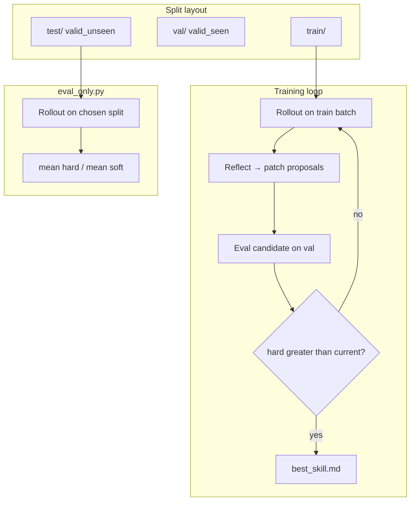

# SkillOpt vs Gategrid — measurement vs improvement

**Status:** 2026-05-28 · product research from competitive scan of [microsoft/SkillOpt](https://github.com/microsoft/SkillOpt) and Gategrid positioning.

**Related:** [mcp-tool-eval-market-research.md](mcp-tool-eval-market-research.md) (L2 routing drift) · [competitive-landscape.md](../product/competitive-landscape.md) · [README-pitch-draft.md](../product/README-pitch-draft.md) · [v1-implementation-checklist.md](../engineering/v1-implementation-checklist.md#phase-6--post-v1-defer) (6.13) · [adoption-usability-backlog.md](adoption-usability-backlog.md) (ADOPT-024)

---

## Executive summary

| Finding | Implication for Gategrid |
| ------- | ------------------------ |
| SkillOpt’s **shipped artifact** is an improved `best_skill.md` (measurable uplift on six public benches) | Our wedge today is **trust** (git baseline gate), not **discovery** of better prompts/skills |
| SkillOpt eval = per-benchmark native scorer + **held-out val gate** + test on `valid_unseen` | We already have the **gate** primitive; we do not run an **outer optimization loop** |
| MCP/tool buyers fear **description routing drift** (L2) | **Tool / skill / prompt-surface optimization** is on-brand: short, git-diffable text, same case pack, accept only if gate passes |
| Full SkillOpt clone (multi-benchmark training, reflection stack) is out of v1 scope | Post-v1: **scoped** “optimize descriptions for one profile” that **consumes** `run` + `gate`, does not replace them |

**Proposed product extension (post-v1):** Gategrid **finds and gates** better tool descriptions (and similar profile text) for **one production profile** — optimization proposes edits; **only merged artifacts that pass the existing regression gate** ship.

---

## What SkillOpt optimizes vs measures

SkillOpt does **not** fine-tune model weights. It trains a **natural-language skill** (`best_skill.md`) for a **frozen target model** using:

1. Rollout batches on **train**
2. Reflection → bounded **add/delete/replace** edits (text “learning rate”)
3. **Selection eval** on `valid_seen` → `val/` — accept only if `cand_hard > current_score` (strict; ties reject)
4. **Reported test** on `valid_unseen` → `test/` with benchmark-native metrics

Paper-reported numbers are **held-out test** percentages (SearchQA EM, SpreadsheetBench hard score, ALFWorld win rate, etc.), not training loss.

**Eval-only path:** [scripts/eval_only.py](https://github.com/microsoft/SkillOpt/blob/main/scripts/eval_only.py) — load config + skill → `EnvAdapter.rollout` → aggregate `hard` / `soft` via shared `compute_score`.

---

## SkillOpt evaluation architecture (reference)

| Layer | SkillOpt | Gategrid today |
| ----- | -------- | -------------- |
| **Unit under test** | Single skill `.md` + frozen model/harness | Matrix: cases × profiles × models |
| **Per-item score** | `hard` (0/1) + `soft` (0–1) in adapter | Evaluator plugins on `RunArtifact` |
| **Aggregate** | Mean hard / mean soft | Pass rate, baseline compare, like-for-like |
| **Acceptance during search** | Val split only | N/A (no search loop) |
| **CI / ship criterion** | Test split in paper; user runs `eval_only` | `gate` vs git baseline on **one profile** |
| **Deliverable** | `best_skill.md` | Pass/fail + `.gategrid/reports/` + baseline JSON |

**Harness modes (SkillOpt):** direct chat (Azure/OpenAI), Codex exec, Claude Code exec — same scorers, different rollout path.

**Benchmark scorers (examples):**

| Benchmark | `hard` | `soft` |
| --------- | ------ | ------ |
| SearchQA / OfficeQA | SQuAD-style EM | Token F1 |
| DocVQA | ANLS ≥ threshold | ANLS |
| LiveMathematicianBench | MCQ label match | Same as hard |
| SpreadsheetBench | All test cases pass | `n_pass / n_cases` |
| ALFWorld | Episode won | 1.0 if won |

Datasets are **not** in the SkillOpt repo; user supplies `split_dir` with `train/`, `val/`, `test/` JSON.

---

## Product gap: measure vs improve

| | SkillOpt | Gategrid (v1) |
| - | -------- | ------------- |
| **Buyer promise** | “We made the agent better on this domain” | “We proved your stack did not regress” |
| **Output** | Optimized skill artifact | Gate report + baseline |
| **When it pays** | Benchmark / domain adaptation projects | Every PR on production profile |
| **Risk if missing** | Teams still need CI gates elsewhere | Teams lack a guided way to **improve** tool routing copy |

Both are valuable. **Measurement is the engine; optimization is an optional head** that uses the same engine as acceptance tests.

Gategrid should **not** abandon git-native gates to become a six-benchmark training product. Differentiation: **scoped, repo-local, gate-gated** surface optimization (MCP descriptions, profile tool metadata, routing prompts).

---

## Fit with MCP / tool eval research

[mcp-tool-eval-market-research.md](mcp-tool-eval-market-research.md) defines **L2** — tool surface in an agent:

> *“The model stopped calling our tool after a description tweak.”*

SkillOpt optimizes long **domain skills** for whole tasks. Gategrid’s natural unit is **shorter, versioned surfaces**:

- MCP `description` and schema help text
- Profile `data.tools` / contrib MCP tool metadata
- System-prompt fragments that affect routing

Same loop shape as SkillOpt (rollout → score → propose edit → **hold out** → accept), aligned with **one profile + one case pack** in CI.

---

## Proposed Gategrid extension (post-v1)

**Name (working):** tool / skill **surface optimization** (not full SkillOpt parity).

### Minimal loop

1. **Frozen matrix** — same cases, profile, model; vary only text under optimization (A/B profiles or parameterized tool descriptions in YAML).
2. **Scorers** — existing evaluators (MCP gate, routing checks, domain outcomes) plus optional L2 metrics: correct tool selected, args valid.
3. **Proposer** — optimizer model (or human) emits **bounded** edits (patch list, char/token cap).
4. **Selection split** — small held-out case subset for accept/reject during search (SkillOpt `valid_seen` analogue).
5. **Ship criterion** — full gate pack + `gate` vs git baseline; baseline update on `main` only (unchanged policy).
6. **Deliverable** — PR patch (e.g. updated tool YAML) + report showing uplift on selection split and no regression on gate pack.

### What core owns vs contrib

| Layer | Responsibility |
| ----- | -------------- |
| **Core** | `run`, `gate`, matrix expansion, baseline — unchanged |
| **Core (later)** | Optional `optimize` CLI or documented outer loop contract (epochs, selection split, artifact paths) |
| **contrib / user repo** | Proposer, reflection prompts, domain case packs, MCP-specific routing evaluators |

Optimization runs **offline** or on `workflow_dispatch`; **PR CI only verifies** the winning artifact (no search in every PR).

### Positioning sentence

> Gategrid **finds and gates** better tool descriptions for your MCP profile — the same cases you run in CI, with a regression baseline so improvements do not trade away last week’s behavior.

---

## Differentiation vs SkillOpt

| We lead | We defer to SkillOpt / others |
| ------- | ------------------------------ |
| Git baseline + single-profile **regression** gate | Multi-benchmark training suites |
| Matrix compare (profiles × models) on **user** cases | General six-bench paper matrix |
| MCP L2 routing + tool contract in **user repo** | Long-horizon domain skill training |
| “Optimize → only merge if `gate` passes” | Unbounded self-edit without repo gate |

**Complementary story:** SkillOpt (or EvoSkill, TextGrad) produces candidates; Gategrid **proves** they are safe to merge on **your** case pack.

---

## Risks

| Risk | Mitigation |
| ---- | ---------- |
| Cost & flakiness | Mock/no-key path; small selection split; cap epochs |
| Scope creep | One profile, one repo, one case pack per spike; no core reflection stack in v1 |
| Optimizer in CI | Search offline; PR runs `run` + `gate` only on committed artifact |
| False uplift on tiny val | Document selection vs gate pack; require gate pack non-regression |

---

## Phased roadmap (research → product)

| Phase | Goal | Exit signal |
| ----- | ---- | ----------- |
| **R1 — Spike** | Manual A/B: two tool descriptions, same matrix, compare reports | Documented pass-rate delta on dogfood MCP pack ([dogfood-notes.md](dogfood-notes.md)) |
| **R2 — Selection split** | Case set tags: `gate` vs `selection` in YAML; gate policy documented | `gate` unchanged; selection cases excluded from baseline file |
| **R3 — Outer loop (contrib)** | Script or `contrib/optimize`: propose → eval selection → accept/reject | Beats initial description on selection; `gate` green on full pack |
| **R4 — Product** | Optional CLI, docs, example in [examples/gategrid/](../../../examples/gategrid/) | Third-party repo can reproduce without forking core |

Engineering tracker: [v1 checklist §6.13](../engineering/v1-implementation-checklist.md#phase-6--post-v1-defer). Backlog: **ADOPT-024** in [adoption-usability-backlog.md](adoption-usability-backlog.md).

---

## Open questions

1. **Artifact format** — patch to profile YAML vs standalone `best_tools.yaml` vs PR to MCP server repo?
2. **Routing evaluator** — extend MCP contrib evaluator vs new `@evaluator` for “expected tool name”?
3. **Baseline policy** — after optimization merge on `main`, single `baseline update` or dual baseline (routing vs outcome)?
4. **Spike repo** — [fast-mcp-telegram](https://github.com/leshchenko1979/fast-mcp-telegram) `evals/` vs [examples/gategrid/](../../../examples/gategrid/) MCP matrices?

---

## References

- SkillOpt repo: [github.com/microsoft/SkillOpt](https://github.com/microsoft/SkillOpt)
- Paper: [arXiv:2605.23904](https://arxiv.org/abs/2605.23904)
- Project page: [microsoft.github.io/SkillOpt](https://microsoft.github.io/SkillOpt/)
